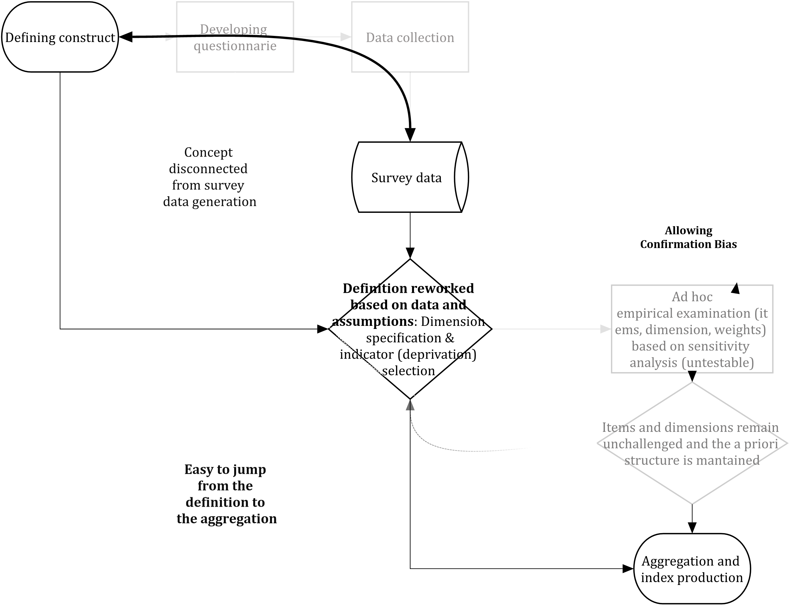
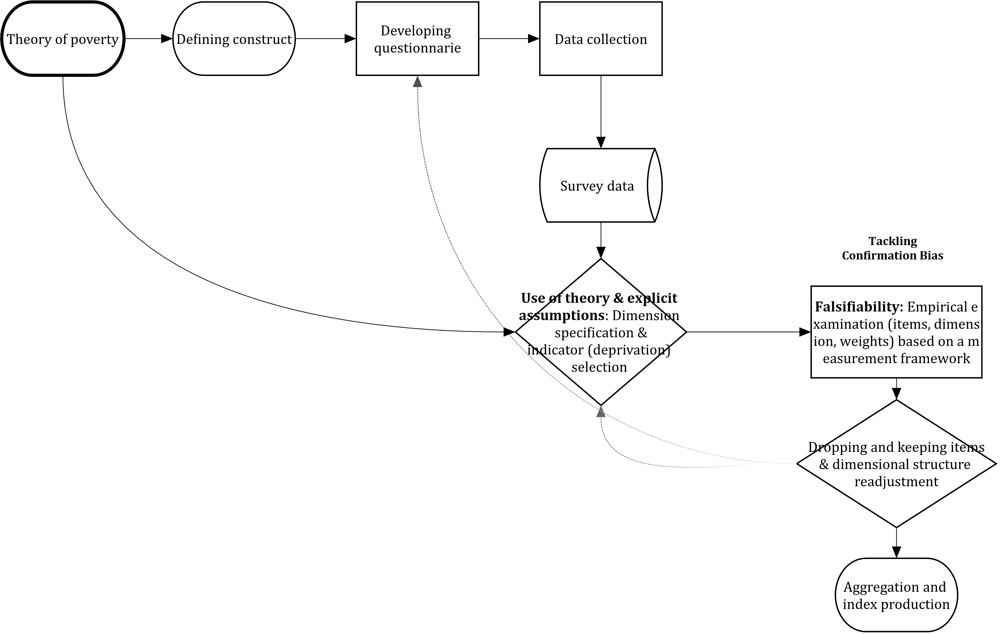
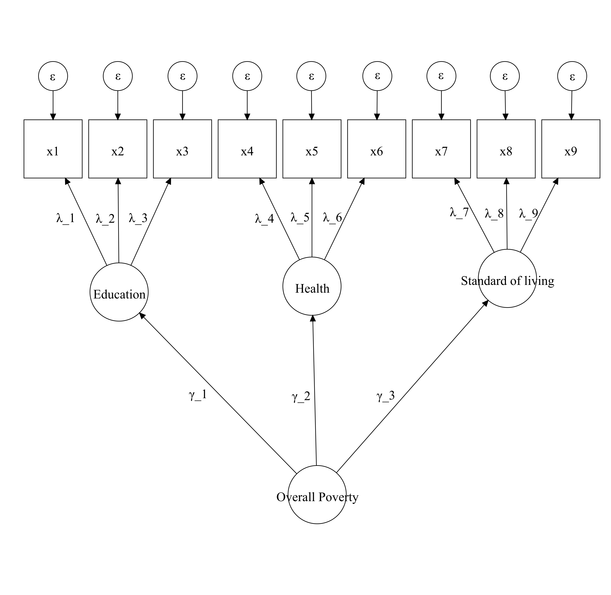
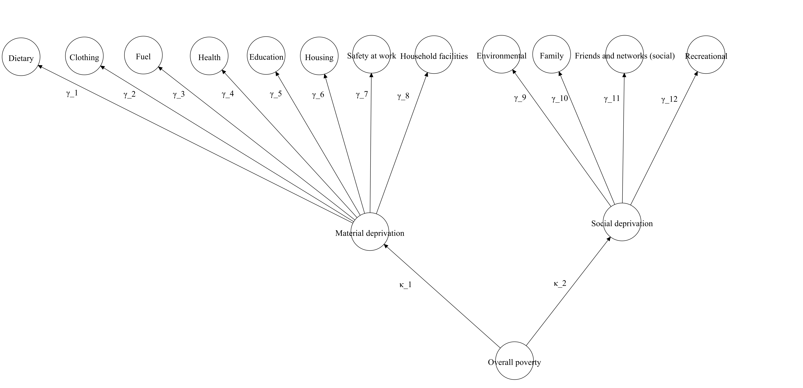

# Poverty and measurement theory: A statistical framework {#Chapter-2}

**Abstract**

This chapter outlines a statistical framework to tackle some of the challenges that involved in multidimensional poverty measurement. Measurement theory is posed as overarching framework for the assessment of some of the key assumptions made in the production of multidimensional poverty scales. The concepts of reliability, validity, measurement invariance and scaling are defined and put into the context of poverty research. Working examples of this concepts are then presented in the following chapters of the book.

## Workflow in poverty measurement: A falsifiable framework

Chapter 1 outlined some of the tasks involved in the development of multidimensional poverty indices and highlighted the assumptions underlying each stage: dimensions, indicators and thresholds or cut-point selection; weighting of dimensions and indicators; aggregation or production of a score and setting of a poverty line @Alkire2007, @Thorbecke2007 and @Gordon2012. 

Figure \@ref(fig:realwf) illustrates the strategy often followed by researchers to produce a poverty index. Data often precedes the measurement (data ara given). Therefore, researchers have little influence upon the data collection process and thus they are constrained and have to adapt the existent information on deprivation to their poverty definition -or in the worst cases, they have to adapt the definition to the data-. A series of assumptions are raised with regard the number and type of dimensions, the indicators (including cut offs to identify deprivation) and weighting (see [Chapter 1](#Chapter-1). Ideally, these assumptions should be assessed using a framework but in practice researchers avoid this stage or they conduct a series of ad hoc sensitivity analyses. The limitation is that these kinds of analyses have no hypothesis and researchers are more likely to confirm their beliefs due to the lack of a clear testable strategy. Confirmation biases, therefore, are more likely to remain and basically researchers jump from their theoretical measure to the aggregation procedure. 


```{r realwf, echo=FALSE, message=FALSE, fig.cap=c("The workflow researchers often implement in multidimensional poverty measurement."), message=FALSE}

```

Scientific measurement aims to incorporate a framework to falsify researcher's assumptions. Figure \@ref(fig:idealwf) shows the strategy that researchers could employ to reduce confirmation biases and measurement error. A theory of the concept of poverty should guide the development of a survey questionnaire and data collection. Researchers then could further specify the structure of their poverty measure based on the theory-driven data generation process. Once the theoretical measure is defined, assumptions need to be identified and make explicit so that can be falsified using a sound statistical framework. The results can be used as an input to redefine the measure in an iterative process. Once the measure is proven to be robust (using a definition of what a good measure is derived from a measurement framework), researchers could move onto aggregation and the identification of the poor and not poor groups. 

```{r idealwf, echo = FALSE, message=FALSE, fig.align='center', fig.cap="Ideal workflow in multidimensional poverty measurement", fig.pos='H'}

```

One possible and useful way to advance in the empirical assessment of poverty indices consist in detecting the assumptions involved in the production of an index and translate them into a falsifiable framework. That is, raising questions about all researcher's assumptions and propose a method to answer whether researcher's ideas hold given the data. 

The challenges involved in poverty research can be put in terms of sequential stages following list of problematic or contested issues in poverty measurement. All these issues are part of an effort to approximate the extent and identification of poverty and can be therefore written in terms of a statistical model: a simplified and imperfect description based on observed data. As @McCullagh2002 argues the idea of a statistical model conveys the recognition that the characterization of something is just an approximation. As such, a model to measure poverty is one possible option that can be assessed and improved. Before saying how a poverty measurement model can be examined and improved, is important to present an organised falsifiable framework of the key assumptions in poverty measurement.

## Identification of the sampling space {#samplingspace}

One of the often-overlooked features in poverty measurement is that fact that researchers never work with the full set of information. The main reason is that such set is unknown or unavailable. Given a definition of poverty, there are different dimensions, indicators and parameters to produce a working model to approximate poverty. But all these options belong to a space with all possible options. This is a major aspect of poverty measurement and highlights the fact that there is an underlying assumption (based on theory or data) about what subsets would work better to measure poverty. 


1. Sampling space of all possible dimensions $\mathscr J$
2. Sampling space of all possible variables $\mathscr X$
3. Sampling space of all possible parameters (e.g. weights) $\Theta$

This is just a statistical model throughout which poverty is identified and can compactly be written as:

\begin{equation}
(\#eq:mainmodel)
\mathscr F = \{\mathscr X, F_{\theta} : \theta \in \Theta\}
\end{equation}

where the variables $x_1,...,x_n$ follow a certain distribution $F_{\theta}$, which is indexed by a parameter $\theta$ defined in the parameter space  $\Theta$. $\mathscr F$ is a family of all probability distributions on $\mathscr X$, which is just the set of all possible observed data.

## Selection of dimensions and indicators

Poverty measurement therefore involves sampling from different spaces (array of options). For example, they put forward some dimensions, variables and weights. This is often the first challenge in poverty measurement where researchers select some dimensions $j$ from the sample space  $\mathscr J$ and some $x_{ij}$ from the sample space $\mathscr X$, so that if the scale has 30 indicators $\mathscr X={1,2,...,30}$ where $x_{ij}=1$ when deprived and $x_{ij}=0$ (and $z>0$ for binary variables). For nominal variables, there is a space of possible cut offs $\mathscr Z$ too.

Selecting dimensions, indicators and thresholds involves assuming that the sampling from the different spaces is the best possible one, i.e. the one that leads to a good poverty measure How does a researcher know whether its selection(sampling) is not wrong? This can be broken down into several questions:

* Is the subset of dimenions $j$ from $\mathscr J$ an \emph{adequate} characterization of poverty?
* Is the subset of indicators given a cut off $(X;z)$ from $\mathscr X$ an \emph{adequate} characterization of the dimension $j$ and poverty?

The word *adequate* is a loose term as this point as we need a theory or standard to define it. This is covered in the next section but at this point, the focus is on the into translating the challenges in poverty research into assumptions to build a statistical model (that later can be testable in some way). 

## Aggregation and weighting 

The first stage is focuses in indicator and dimension selection and as it will be discussed below, this is where a falsifiable framework is more useful but also absent in poverty research. One way to illustrate it is with the AF method. The AF method will produce sensible results as long as the indicators are reliable and valid but there is nothing within it that will ensure that this will be the case. Therefore, once the indicators have been selected, in a second state, researchers aggregate the variables using a linear model selecting some weights $w \in \mathscr W$,  where $w_{ij}=1$ for non-differentially weighted measures and $w_{ij}\ne 1$. 

* Does the weighting scheme lead to the same ranking of the population? 

### Splitting the population into meaningful groups

Once the model of poverty has been completed $\mathscr F$ a score is produced for each person in the sample. That means that a threshold should be proposed to identify the poor population.

## Measurement theory as an statistical framework

## Poverty and error in measurement

Poverty, as happens with many other constructs in social sciences, is an idea. It emerges from the theoretical presumption that within a population there is a group of people whose livings standard are below of what a society at a given point in time consider essential and customary to have a decent life. Poverty, in theory, impedes full participation in society, enhances the risk of die younger, interacts with many social risks, etc. But poverty is difficult to pinpoint because it is not directly observable and cannot be described with accuracy by a single variable. Instead, poverty research must rely on imperfect multivariate data to rank the population according to their living standards. To make things more difficult (see previous section), there are many ways in which poverty can be captured or described as researchers rely on different sets of outcomes (different samples from the same space) to characterise one's living standards (diverse deprivation/needs/achievements). Poverty thus is a latent variable in that several outcomes are utilized to imperfectly describe it^[There is another framework that incorporates the idea of measurement error. Fuzzy sets theory uses the term vagueness to describe the intrinsic imperfection in poverty measurement [@Martinetti2006]].

The problem of capturing poverty as a construct is just one of many cases in social sciences where researches face the difficulty of finding a theoretically constructed (unobservable) group (e.g. the depressed, high class, high achievers in education, happy). How then can we detect a group of people belonging to a construct? @Spearman1904 put forward a capital idea: two or more outcomes is an indication that two things may have the same underlying cause. This perfectly fits the theory that deprivations are an observed outcome of poverty. A core assumption in poverty measurement is that a set ($X \in \mathscr X$) of indicators constitutes the series of relevant manifestations of the idea of poverty. This treatment of poverty as a construct is powerful in that is a theoretical underpinning and rationale for finding and ranking individual differences in living standards (below which one is poor).

Deprivation indicators are intercorrelated because they share a common cause: poverty. Conceptually, this means that if the effect of poverty is eliminated the inter-correlation of outcome variables would be zero. Measurement theory postulates that the problem of the relevant set of outcome variables to measure poverty can be tackled from the perspective of the *common factor model* @Thurstone1947. Such a model formally postulates that the observed outcome is a function of one or more common factors and one unique factor. Each deprivation should vary due to two main sources (1) common variance and (2) unique variance. The first type of variance is the one accounted by for the latent factor- the variance shared with the other outcome measures. The second is the variance accounted by for other factors and by random error (unreliability, measurement error).

## Measurement model for poverty

The statistical model proposed in modern measurement theory would be a common factor model where each observed variable ($x_{ij}$) is a product of a latent dimension ($\eta_j$) and the higher order factor ($\zeta_h$) overall poverty. One of the interesting aspects of this formulation is that 
as not everything is due to the latent variable, error theory of a measurement model includes the method effect.  

\begin{equation}
(\#eq:model1)
 x_{ij} = \lambda_{ij} \eta_j + \varepsilon_ij  
\end{equation}

\begin{equation}
(\#eq:model2)
 \eta_j = \gamma_{j} \zeta  + \xi 
\end{equation}

The $\lambda_{ij}$ and $\gamma_{j}$ are known as factor loadings and they capture the relationship between the latent variables and the outcome measures, and between the dimensions and the overall latent variable. Of course, it is possible to have more $\zeta$'s but in poverty research the presumption seems to be that dimensions are nested into one overall latent construct which is poverty (some especial cases will be shown in Section XX where the higher-order model is a third-order factor):

Poverty &#8594; Dimensions &#8594; Sub-dimensions &#8594; outcome measures. 

This model specification is one way to statistically capture the way in which multidimensional poverty measurement is conducted in the contemporary literature. Researchers propose a series of dimensions and classify their proposed indicators accordingly. The crucial aspect is that this is just an idea -informed from some theory or data- about how poverty can be better captured under a multidimensional definition. That is, the proposal is just an invalidated model that demands scrutiny. When put in terms of equation \@ref(eq:model1) and equation \@ref(eq:model2) researchers move from theoretical speculation toward empirical falsification. 

## Blueprints and poverty measurement models {#Chapter-2-blueprint}

Models are just the blueprints of poverty indices that summarise how a scale can be constructed. Putting theoretical proposals to measure poverty in terms of a diagram helps a lot to visualise and contrast the diverse proposals to measure poverty. The advantage of measurement theory is that everything can be put in terms of a blueprint. Multidimensional models can be easily presented as a diagram, which is just a graphical representation of a model. Another way to think about this, is to see the different blueprints in poverty measurement are just the different ways in which researcher sample from $\mathscr J$ and $\mathscr X$. They lead to diverse structures, i.e. models. 

Equation \@ref(eq:model1)  simply tells a model in which one latent construct produces the observed ($x_{ij}$) outcomes. This model is said to be unidimensional as there is only one factor $\eta_j$ causing the observed indicators. One could think of this model as the null model in poverty measurement where the indicators cannot be clearly clustered into dimensions. This does not mean that the indicators do not measure different aspects of poverty. It might be that the indicators indeed different aspects but that there are no clusters of indicators. In practice, there are few theoretical models proposing such thing. Empirically, however, it might be often a case given that in poverty research data collection rarely follows a theoretical proposal (see *add chapter reference*). Figure \@ref(fig:cfanull) translates \@ref(eq:model1) into a plot. 


```{r cfanull, echo = FALSE, message=FALSE, fig.height = 6, fig.width = 5, fig.align='center', fig.cap=c("This is a visual representation of a null unidimensional model."), echo=FALSE}
knitr::include_graphics("Diagram_CFA_null.png")
```

Figure \@ref(fig:cfaguio) displays the higher order factor model using the three dimensions proposed by @Guio2009. This structure is roughly what poverty researchers have in mind when thinking about poverty in multidimensional terms. That is, that the indicators can be grouped into some dimensions. In this example, there are 9 outcome variables classified into three dimensions ($\eta_j$) (Durables, Housing and Economic strain). Then the loadings ($\lambda_{ij}$) denote the relationship of each outcome with the dimensions in question. Then the arrows from the high-order factor (overall poverty) to each dimension are the factor loadings ($\gamma_{j}$) that capture the relationship between overall poverty and each dimension. Both ($\lambda_{ij}$) and ($\gamma_{j}$) are parameters of the model and denote the strength of the association between the latent variable and the outcome variables (See *\ref{cha:reliability}* for an explanation of how this relates to the topic of reliability and differential weights). The diagram of \@(fig:cfaguio) model is an example of a higher-order factor: A three-dimension model with a higher-order factor. The dimensions are durables, housing and economic strain. In this example, there are only three indicators for each dimension. In this model, none of the indicators loads into more than one dimension. Poverty measures often assume that a given indicator is an exclusive outcome of a certain dimension. 

```{r cfaguio, echo = FALSE, message=FALSE, fig.height = 6, fig.width = 5, fig.align='center', fig.cap="This is a visual representation of @Guio2009's model. Second-order factor.", fig.pos='H'}
knitr::include_graphics("Diagram_CFA_GuioModel.png")
```

Another way to think about the dimensions of poverty comes from @Alkire2010, which is used to compute OPHI-UNDP's Multidimensional Poverty Index (MPI). The structure proposes a similar structure to @Guio2009's model: second-order structure. In this case, poverty is thought to have three substantive dimensions: Education, health and living standards. These are different dimensions from those proposed by @Guio2009 or by @Townsend1979 in figure \@ref(fig:cfampi). The diagram only specifies, at this point, the structure of the measure as the MPI does not have three indicators for each dimension but it helps to see the model the authors put forward to measure global acute poverty.

```{r cfampi, echo = FALSE, message=FALSE, fig.height = 6, fig.width = 5, fig.align='center', fig.cap="This is a visual representation of @Alkire2010's model. Second-order factor", fig.pos='H'}

```

@Townsend1979's model is one of the first multidimensional models in the world. His proposal has more nested dimensions compared with figures \@ref(fig:cfaguio) and \@ref(fig:cfampi). In this case, indicators are nested into eleven dimensions, which in turn can be grouped into two more dimensions. The resulting figure (\@ref(fig:cfatownsend) is a third-order factor structure. @Guio2017 propose a reduced version of this model which does not considers the 11 dimensions and indicators are classified according to material and social deprivation. The loadings of the indicators are omitted. $\kappa_1$ and $\kappa_2$ are the loadings of the higher order factor. These could be specified using \@ref(eq:model2) as reference- now $\zeta$ has k=2 factors.

```{r cfatownsend, echo = FALSE, message=FALSE, fig.height = 6, fig.width = 5, fig.align='center', fig.cap="This is a visual representation of @Townsend1979's model. Third-order factor.", fig.pos='H'}

```

Another way to think about this, is to see the different blueprints in poverty measurement are just the different ways in which researcher sample from $\mathscr J$ and $\mathscr X$. They lead to diverse structures, i.e. models. This reflection brings us back again to the question: how do we know whether the samples we take from $\mathscr J$ and $\mathscr X$ are an adequate representation of poverty in a given society at a given point in time? 

## Measurement theory and principles

One central debate in poverty measurement is about the dimensions of poverty. The discussion revolves around questions such as: How many dimensions are? What are the contents (indicators) of these dimensions? How dimensions are associated and differentiated? Do these dimensions have equal importance? (see *\ref{cha:Chapter_1}*). The previous section translated these questions into concrete challenges and advanced a general framework of measurement that explicitly acknowledges that all measurement practices involve different kinds of error. However, the framework is incomplete. It requires some governing principles that effectively put the workflow in poverty measurement in terms of a cogent falsifiable framework. One crucial question raised in section~*\ref{sec:samplingspace}* are: 


* Is the subset of dimenions j from $\mathscr J$ an adequate characterization of
poverty?
* Is the subset of indicators given a cut off $(X;z)$ from $\mathscr X$ an \emph{adequate} characterization of the dimension $j$ and poverty?
* Does the weighting scheme lead to the same ranking of the population? 

### Origins of measurement theory

Measurement consists in assigning a series of numbers to individuals in such a way that they represent quantities of attributes [@Nunnally1994]. *Measurement theory* is a framework that postulates that a series of outcome measures are manifestations of a latent trait in each individual. That is, a framework to turn a series of deprivation indicators into numbers so that they express the unobserved level of poverty of an individual. Hence, measurement theory aspires to provide a series of rules to distinguish signal from noise so that our observed measures approximate the latent trait in question.

The origins of measurement theory can be traced back to classical test theory [@Lord1952;@Novick1966]. This theory postulated that a true score is a linear combination of an observed score and error. This idea has been taken forward by the latent variable approach through a series of breakthroughs in theory, conceptualisation via latent constructs and computation [@Cudeck2012;@Rusch2017]. The consolidation of this framework required parallel and temporarily disconnected contributions in factor analysis and item response theory (IRT). After @Spearman1904's seminal one factor model and @Thurstone1947 multiple factor contribution, as series of works in the 1960s proposed formulating factor analysis not in terms of a correlation matrix but in terms of a model @Lazardfeld1968;@Lawley1971. Later and independently, it seems, from factor analysis, in educational testing and psychometrics, a series of works from @Stocking1983 and @Bock1981 proposed item response theory (IRT) which proposes that indicators are measures of observed manifestations of an underlying trait [@Reise2014]. The birth of IRT was almost contemporary to  @Joereskog1970;@Joreskog1979's contributions to confirmatory factor analysis and structural equation models. These factor models could be seen now as general case of IRT for categorical variables [@Muthen1984].

Modern measurement theory is a more unified framework that postulates that outcome measures are manifestations of a latent trait, that such manifestations could be clustered together into sub-dimensions, that measurement will always have error and that all these aspects should have an empirical counterpart to that can be tested [@Cudeck2012]. 

Measurement theory since the seminal work of @Spearman1904 has continuously developed a cogent framework that aims to produce measures that: 1) consistently offer the same ranking of a population and 2) a ranking represents an ordering of the population with respect the phenomenon we aspire to measure. The two aims gave birth to the concepts of *reliability* and *validity*. Furthermore, these two have important implications in terms of weighting, comparability and identification of (unobservable) population groups. 


