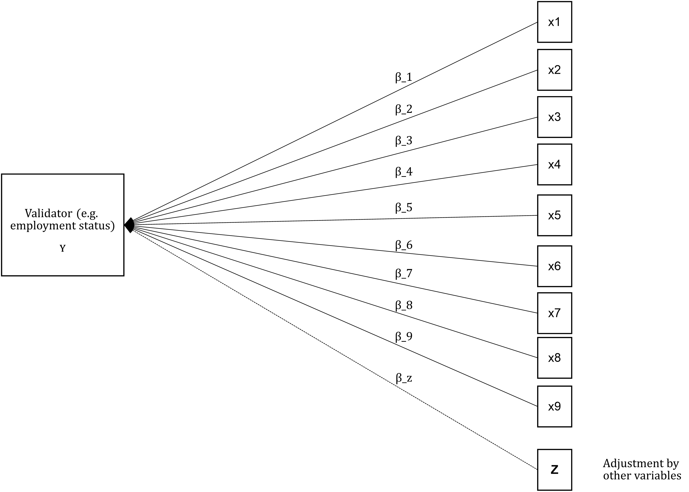
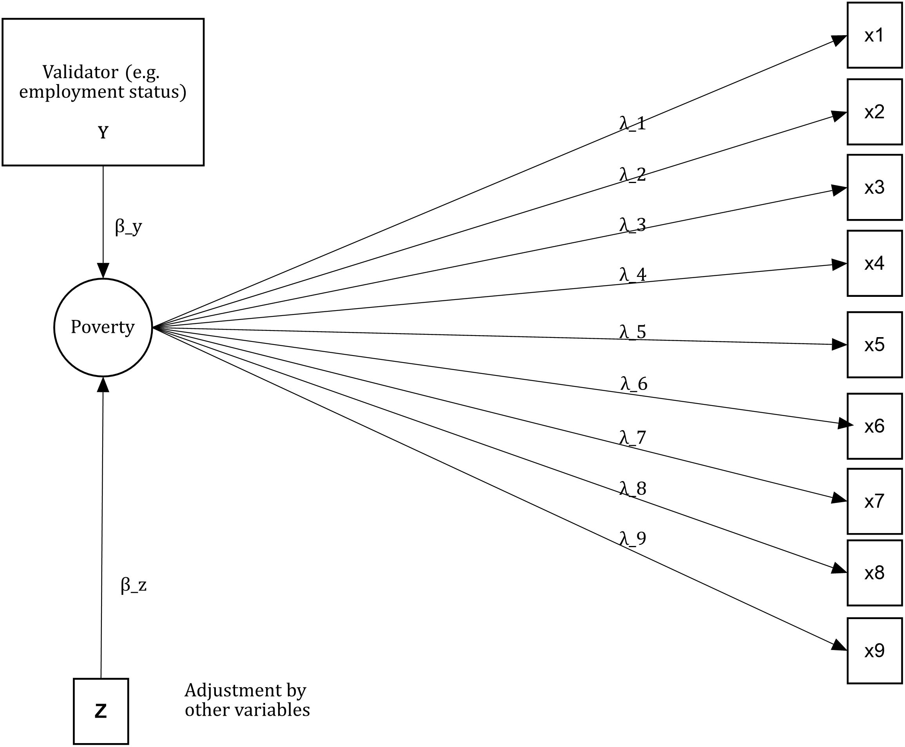
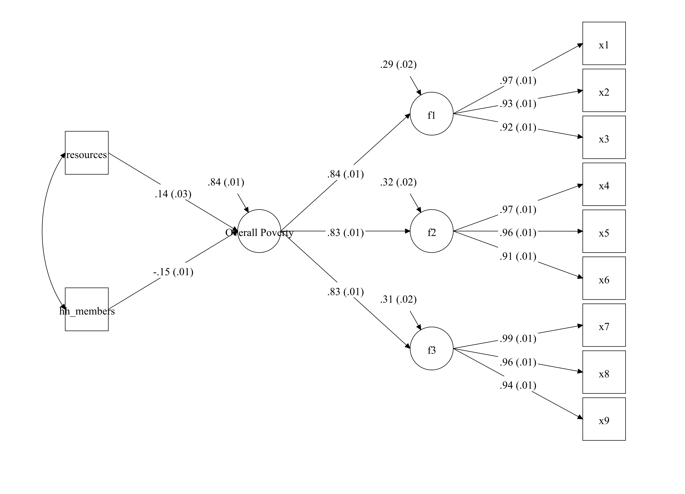
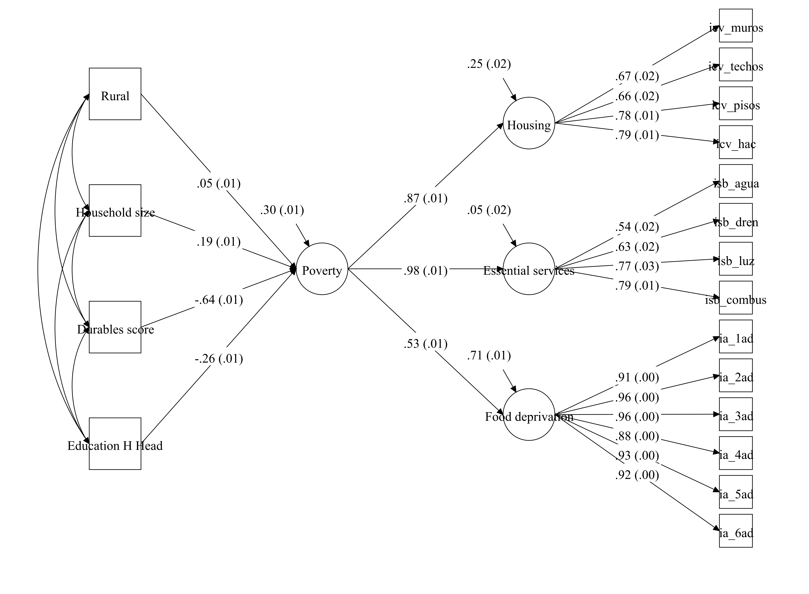

# Validity in poverty measurement {#Chapter-4}

**Abstract**

This chapter focuses on the theory and implementation of validity. An intuitive explanation is provided about the relationship between reliability and validity and then the different definitions of validity are reviewed. The chapter then uses simulated data to illustrate how construct and criterion validity can be investigated using R and Mplus. The chapter finalised by looking at a real-data example.

## Intuition to the concept of validity

We have seen so far that reliability is homogeneity in measurement and it means the capacity of a measure to reproduce the ranking of a population under changing conditions. Reliability, thus, will tell us whether the set of indicators will be useful to order individual's according to their latent scores which we presume reflect poverty. Therefore, reliability is a necessary condition for good measurement but not a sufficient one. We need to make sure that our indicators are effectively capturing poverty.

Imagine that we know the standards of living of two subject in a sample- one highly educated, wealthy and healthy and another with low education attainment, with a lot of debt and with systematic health problems. However, we find an unexpected result. The first subject is ranked lower than the second one, i.e. is more likely to be poor than the second. Measurement theory tells us that our scale is reliable but invalid. That means that there is very little evidence to interpret our index in accordance with our theory and concept of poverty.

A valid measure is one that tells use the nature of what is being measured and its relationship with the index in question to its cause. Validity is a property that aims to assess the extent to which an index captures what we mean to measure. In other fields, one could ask someone the amount of sugary drink they had in a week. This information could be recoded using a questionnaire, for example. How can we validate this measurement? Well, we could follow someone everywhere and every time and take notes of their drinking behaviours. Then we could compare our measurement to hers to assess the precision of our instrument.

Can we follow the same strategy in poverty research? No, we cannot as we work with an unobserved construct. The history of the Standards for Educational and Psychological Testing summarises the conceptualisation of validation of constructs. The way forward has been an unified framework of validity which looks at the extent to which the existence evidence on a scale supports the intended interpretation of test scores for the proposed use [@AERA2014].

## Theory of validity

Classical test theory (CTT) proposes that reliability is the maximum possible validity of a scale. Reliability is affected by both systematic and random error but systematic error only affect validity. How this is possible according to CTT? The observed score is just the combination of the true score plus error. Validity is a function of systematic error (i.e. constant deviations from the construct of interest) and results in deviations from the construct of interest. That means that a scale can be reliable but always wrong because it always deviates from the target of interest. In CTT validity is formulated as follows:

\begin{equation}
(\#eq:validity1)
V = \frac{\sigma^2_{CI}} {\sigma^2_{observed}}
\end{equation}

The problem with this formulation is that it was little practical usage as the problem in question is knowing $\sigma^2_{CI}$. The best approximation for this notion of validity consisted in focusin on the predictive capacity of a scale. Nonetheless, this approach to validity changed after the 1950s. @Bandalos2018 provides and overview of how the *standards* have both discussed and expanded the definition of validity over time. In the 1950s, criteria and predictive validity were the dominant approaches in both psychometrics and educational measurement literature. These two forms of validity focused on the correlation between the scale in question and a predictor of the phenomenon of interest. In our example, criterion validity would have shown that our scale had an inverse relationship with some observable attributes of the subject in the sample. Therefore, the scale would have been regarded as invalid from the perspective of criterion validity.

Criterion validity demands a clear theory about the causes and consequences of the phenomenon of interest. @Townsend1979 provides a good framework for such a purpose in that it provides a clear causal mechanism: command of resources, poverty and deprivation. Therefore, measures of command of resources (another latent construct) could be used to predict poverty. For example, in Townsend's theory there are five main types of resources. Drawing upon, @Townsend1979, criterion validity has been used in poverty measurement by @Guio2012 for the production of the European deprivation index and by @Gordon2010 in his proposal for the Mexican multidimensional measure. Similarly, @Nandy2015 used criterion validity to assess their proposed index for Benin.

The association of an index with a predictive criterion may be inadequate or infeasible in some circumstances. In practice, some scales are developed to target certain aspects of a construct, for example, in poverty research it could be acute poverty or housing and facilities deprivation. In other settings, policymakers or institutions might prioritise some aspects of poverty from a human rights perspective, for example. This consideration leads to content validity. In poverty measurement, perhaps the most emblematic recent example is the Mexican measure. Drawing upon the Mexican Constitution (1917), the National Social Development Law defined poverty in terms of social rights. Because the Mexican law represents the will of the people, this gives a content validity to the measure [@Gordon2010]. This, nonetheless, does not means that the law will lead to a valid scale. It means that the one should assess validity in accordance to the definition, i.e. examine whether the dimensions and indicators lead to a reliable and valid measure.

One critical question about content validity is about how does a researcher **knows** or **defines** the constituent parts of the phenomenon of interests. Most of the time these aspects come from theory. However, the use of mixed methods is a way to enhance the capacity of theorists to develop concepts and frameworks about the mechanisms through which such concepts interact. The use of different kinds of good data will enhance the theory that gives content to a concept. **Face validity** is a form of validation that comes mainly from qualitative work. One way to see face validity is thinking in terms of how transparent a test looks like for the participants of the measurement. In other words, how sensible a the contents of a poverty index seem to the poor and the not poor. There are several qualitative methods to assess face validity and the best implementation to date is the Poverty and Social Exclusion project implementation of the Consensual Method (@Pantazis2006a; @Gordon2018). This project follows the ideal work flow production of a poverty measure (see \@ref(fig:idealwf)) in that the concept of poverty has a theory that defines it, the questionnaire is first calibrated with qualitative work (face validity), and then a survey questionnaire is developed with the explicit purpose of measuring multidimensional poverty. 

However, as discussed in Figure \@ref(fig:realwf), in practice poverty researchers work with the data they already have and content validity is constrain and face validity is ignored. Furthermore, in many cases, criterion validity might not be available due to the fact that there is no a clear priority about the aspects of a concept that should be targeted in a measurement exercise. Furthermore, it might be the case that there is no clear predictor to conduct criterion validity. For example, when there is no agreement about the causes and correlate variables of poverty. @Cronbach1955 put forward a third form of validity that suggest that the measurement of the construct should be useful to *meaningfully* split groups. Whereas reliability guarantees certain ordering, construct validity focuses on the meaning of such ranking. Construct validity, at first, was seeing as the last resource but in the contemporary literature is no longer the case. Construct validity requires mounting evidence in favour that the scale does what is meant to do. @Messick1987 argued that construct validity embraces almost all types of validity evidence. For him, all the available evidence on a scale adds to the latent rejection or continuity of a scale. @AERA2014 define validity as (p.14):

> *It is the degree to which all the accumulated evidence supports the intended interpretation of test scores for the proposed used.*

This modern definition refers thus to the different types of evidence on the validity of a scale- criterion, predictive and content.  

## Methods for the analysis validity 

### Criterion validity

Criterion validation is characterised by the correlation between an index and an alternative measure on the cause or effects of the construct of interest. This book is not about the different explanations of poverty but requires an illustration of the importance of having a theory for validity.  This requires a theoretical framework explaining the drivers and consequences of poverty as well as how these two relate with the concept of deprivation. There are several good books on theories of poverty (see for an overview of different sources)[@Spicker2006]. Poverty theories are crudely classified into structural and individual-centred theories. @Townsend1993 and @Townsend1979 provide and overview of these frameworks. To illustrate how a theory of poverty relates to validity we will draw upon Townsend's theory as it is one of the few frameworks that links an explanation of poverty with a cogent theory for its measurement.

Townsend predicts that the lack of command of different kinds of resources lead to deprivation. This means that poverty should be related with different expressions of command of resources such as position in the labour market, education attainment, social class, etc. Poverty leads to exclusion and is said to be a good predictor of ill-health, therefore, poverty should be correlated with a measure of health status too. This means that the type of the employment should be correlated with our index of poverty, for example.

@Gordon2010 proposes fitting a regression model to assess the extent to which the (reliable) indicators of a poverty measure correlate with a proxy measure of command of resources. He used income as a measure of resources given that the Mexican Income and Expenditure Survey lacked a validator (we reflected on the problem of data production for poverty measurement see section). He did fit a Generalized Linear Model (GLM) using a binary variable (income poverty. Poor=1 and Not poor=2) as a response variable and the deprivation indicators as predictors. The model was adjusted by urban/rural and household size. The expectation thus was to find relative risks ratios higher than 1 ($\beta_i>1$) as this is an indication that being deprived of a given item increased the chances of being classified as poor. In @Gordon2010's example the validator is far from ideal but illustrates the idea of criterion validation. In figure \@ref(fig:valgordon) it is proposed a slightly better validator such as the position in the labour market. International occupation scales that aim to measure socio-economic position could be useful for this purpose [@Ganzeboom1996]. There are other alternatives like using subjective indicators of well-being or self-assessments of health status as those used by @Guio2012.

```{r valgordon, echo = FALSE, message=FALSE, fig.align='center', fig.cap='This is a visual representation of @Gordon2010 criterion validation. Here income poverty is replaced by a measure of socio-economic position like employment status.', fig.pos='H'}

```

The advantage of using a unified framework such as measurement theory is that it is possible to further specifying a criterion validation model in terms of a Confirmatory Factor Model plus and explanatory model (Structural Equation Modelling, SEM). In the latent variable literature, these kind of models are known as MIMIC models or Multiple Indicator, Multiple Cause. Figure \@ref(fig:valmimic) shows a visual representation of the criterion validation of the unidimensional model previously shown. In this case, there is a new path from the validator (Y) toward the latent variable. The model is adjusted by a series of covariates (Z). In this model the expectation would be to see that $\beta_y$ to be associated with the factor (poverty) in a sensible way. If the metric of the factor (often standardised with mean zero and variance equal to one), tells that higher values denote higher severity, then we should expect that people with non-skilled jobs to be associated with positive factor values.

```{r valmimic, echo = FALSE, message=FALSE, fig.align='center', fig.cap='This is a visual representation of a MIMIC criterion validation of a unidimensional or null model', fig.pos='H'}

```

We could easily extend this example of criterion validation for a simplified version of the Townsend model. Figure \@ref(fig:valmdmimic) shows that poverty is predicted by a validator and some auxiliary variables (Z). The expectation is to find a predictive relationship between Y and the latent variable. The rest is just Townsend's measurement model of poverty. In this reduced version, only the two main dimensions are presented. In the next section is discussed that having just two dimensions leads to some identification issues for the empirical analysis.

```{r valmdmimic, echo = FALSE, message=FALSE, fig.align='center', fig.cap='This is a visual representation of a MIMIC criterion validation of a reduced version of the theoretical model of Townsend', fig.pos='H'}
knitr::include_graphics("val_md_MIMIC.png")
```

### Construct validity

Construct validity is an ongoing process and it is part of a unified framework of validity. Model specification is central in a statistical framework to measure poverty. This entails making explicit assumptions about the number, type and nature of the dimensions and its indicators. It also involves making assumptions about how the model should behave, i.e. people with multiple deprivation should be more deprived than people with a single or no deprivations, for example. Construct validity comprises different sorts of evidence on the different hypothesis of the measurement model. To ilustrate this we will use the Multidimensional Poverty Measure of acute poverty.

* Multidimensional poverty has three substantive dimensions: education, health and standard of living.
* These dimensions are clearly distinguishable (discriminant validity).
* The indicators of each dimensions are adequate manifestations of deprivation of education, health and standard of living (classification of   indicators).
* The indicators of each dimensions equally account by for variation of the sub-dimensions (within-dimension weights).

The four hypothesis underpin the measurement model of poverty of the MPI. These are ordered from the more general to the most specific. How then these assumptions could be tested. Measurement theory has developed factor models for such a purpose. These models have evolved to such extent that the most powerful factor model could be used to test in one model a number of hypothesis. There are two main ways to conduct factor analysis: exploratory and confirmatory. This book puts emphasis on the second kind as it soughs to encourage the development of scales based on theory and not on what the available data says. The label "Confirmatory" is ambitious in that it suggest that we confirm that our model is right. This, of course, is never possible. The best we can do is to assess whether the model is not a bad one, which does not necessarily means that is the correct one.

Measurement models have a series of parameters  (item loadings, dimension loadings, item thresholds and errors). Confirmatory factor analysis (CFA) is a way to estimate the value of the parameters in question and assess the extent to which the model reproduces the observable relationships among the indicators. This is no different from any experiment where given some assumptions, researchers compute if their model of reality is matched by observation. CFA models aim to assess if the presumed model of poverty seems to hold given the data, i.e. whether there is any indication that there are three dimensions, the indicators seem to relate to these dimensions and the contribution of the indicators is equally important or not within dimensions.

To explain the theory of CFA models is necessary to bring back equations \@ref(eq:model1) and \@ref(eq:model2).

\begin{equation}
 x_{ij} = \lambda_{ij} \eta_j + \varepsilon_ij   
\end{equation}

\begin{equation}
 \eta_j = \gamma_{j} \zeta  + \xi
\end{equation}

These equations represent a hierarchical Confirmatory Factor model. These make our measurement model testable using a method that was developed for such purpose. This model will tell us: if the three dimensions $\eta_j$ ($j=1,2,3$) is an adequate representation of poverty. It will also tell us if the indicators are manifest ($\lambda_{ij}$) of the presumed dimensions, and whether the loadings are equal or not within dimensions.

How does CFA assesses whether a model matches observation? CFA estimates a series of parameters that produce a variance-covariance matrix ($\Sigma$) that approximates as closely as possible the observed variance-covariance matrix ($S$). Therefore, the goal in CFA is to find a set of parameters that best reproduces the input matrix. This process is achieved by minimizing the difference between $\Sigma$ and $S$. Maximum Likelihood (ML) is one of the preferred methods to estimate the minimizing function $F_{ML}$ (see p. 72 and 73 for an explanation)[@Brown2006]. There are, nonetheless, several estimating procedures that are more or less adequate depending on the nature of the data. One of the most useful and adequate for the kind of data in poverty measurement (categorical data with large samples) is robust weighted least squares (WLSMV) as it is faster than ML and is asymptotic distribution free. $F_{ML}$ is very useful because it provides standard errors (SEs) of the estimates but also because it can be used for the calculation of several indices of goodness-of-fit which tell how poor or good the model is.

$F_{ML}$ is used for several goodness-of-fit indices. An absolute index is $\chi^2$ which operates with the null hypothesis that $S=\Sigma$. When rejected, it tell that the proposed model is not good enough to reproduce $S$. In other words, the number, type of dimensions and indicators do not result in an adequate representation of the construct. $\chi^2 = F_{ML}(N-1)$ and thus is sensible to sample size and based on a very stringent hypothesis that $S=\Sigma$.

A relative index of goodness-of-fit is root mean square error of approximation (RMSEA) [@Steiger1980]. This index looks at the extent to which a model is a reasonable approximation in the population. This index is sensible to the number of parameters in the model but insensitive to sample size.

Comparative fit indices use a baseline model (typically a null model) as reference to evaluate the fit of the proposed model. These indexes often look more favourable than the strict $\chi^2$. Extensive Monte Carlo studies have found that these indexes are nonetheless trustworthy and well-behaved. The Comparative Fit Index (CFI) is one of the most widely used. It varies between 0 and 1 where values closer to 1 indicate a good model fit. The Tucker-Lewis index (TLI) is another popular alternative which includes a penalty function for adding more parameters that do not necessarily improve the fit of the model. It typically has values between 0 and 1, where again closer to 1 implies a relatively good model fit.

Several Monte Carlo studies have been conducted to assess the behaviour of these indices [@Browne1993;@Rigdon1996;@Hu1999;@Bentler2007]. From these studies it has been possible to have an approximation to the values of the indices that often indicate a good fit. These values are summarised as follows:

  Table: (\#tab:cfafitstats) Summary of the suggested cut off for the goodness-of-fit statistics.
  The values of RMSEA, CFI and TLI need to be taken as an approximation.

  Index       Range values   Poor model fit rule
  ---------- -------------- ---------------------
  $\chi^2$    p-values 1-0         $p>.05$
  $RMSEA$     p-values 1-0         $p<.06$
  $CFI$          $1-0$             $<.95$
  $TLI$          $1-0$             $<.95$

Factor loadings are often thought as a measure of item-reliability (see Section \@ref()). So how does the factor loading values fit in a validity analysis? There is no consensus about threating factor loadings as measures of item validity. Only and only if the measure is proven to be valid in some way, it is possible to frame item loadings in terms of validity. In such a context, the square of the factor loadings equals the amount of variance in the indicator explained by the common factor (i.e. communality). Because the factor loadings capture the relationship of each indicator with the latent variable, they can be seen as the optimal weights of the model given the data. Therefore, a test of equality of loadings within dimensional can be used to assess whether using such kind of weighting is reasonable or not. The next section shows how these tests work but the idea is to assess the extent to which $\lambda_{11}=\lambda_{21}=\lambda_{31}$, for example for three items in dimension $j=1$.

## Validity assessment

### Criterion Validity

Criterion or predictive validity holds when there is a correlation between an scale and an alternative measure on the cause or effects of the construct of interest. In poverty research, this kind of validation has been used in the empirical literature [@Gordon2010; @Guio2012; @Nandy2015]. We will again use our simulated multidimensional measure to illustrate how a validation exercise can be undertaken and to underline some issue researchers might find in practice.


```{r, include=FALSE}
library(MplusAutomation)
############################################
setwd("C:\\Proyectos Investigacion\\PM Book")
```

Fitting a regression model to assess the relationship between a proposed index and an alternative measure is a common approach to assess predictive validity. To illustrate how this kind of validation works, we will use the simulated data ("Rel\_MD\_data\_1\_1.dat"). This data set contains the nine manifest variables (x1-x9) plus the two unreliable indicators(x10-x11). Three variables were simulated as alternative measures. One is a "perfect" measure of the resources available for each household in the sample. So in principle, this measure ranks the households according to their potential to fulfil their needs. The measure is expressed in monetary terms to facilitate the interpretation. Education years of the household head and occupation (skill scale) are two predictors of the living standards of the households. These two variables reflect the often common case where the survey was not designed with a validator in mind. We will use the variable "hh\_members" to adjust the estimates.

```{r, warning=FALSE, message=FALSE}
library(plyr)
Rel_MD_1<-read.table("Rel_MD_data_1_1.dat")
Rel_MD_1$ds<-rowSums(Rel_MD_1[,c(1:9)])
colnames(Rel_MD_1)<-c("x1","x2","x3","x4","x5","x6",
                      "x7","x8","x9","x10","x11",
                      "resources","educ_yr","occupation",
                      "hh_members","class","ds")
Rel_MD_1[1:5,1:11]
Rel_MD_1[1:5,12:15]
```

One way to conduct the validation analysis consists in estimating the association between the manifest variables of our index with the validator. This can be simply done by fitting a series of regression models. Because deprivations are binary variables, we need to use a Generalised Linear Model (GLM) with the appropriate distribution. Relative Risk Ratios (RRR) are easier to interpret, so we will fit a Poisson model with log link to obtain the RRRs. Of course, there is no problem in estimating odd-ratios as here we are interested in looking at the association between variables.

In total we have 11 dependent variables (x1-x11) and, thus 11 models. In principle, x1-x11 resulted unreliable and should have been dropped from the analysis but we will keep them just to discuss some connections between reliability and validity. We will create a simple function `lms()` below to loop across the deprivation indicators. We will also transform the resources to get a more sensible metric.

```{r warning=FALSE, message=FALSE, results='hide'}
Rel_MD_1$resources<-Rel_MD_1$resources*.01

lms<-function(index)
{
  fit<-glm(Rel_MD_1[,index] ~ Rel_MD_1$resources +
                              Rel_MD_1$hh_members,
           family=poisson(link="log"))
  exp(cbind(OR = coef(fit), confint(fit)))
}

coefs<-lapply(1:11,lms)

coefs[[1]]
```

We could check each of the outputs in list \texttt{coefs} but it is easier to plot the RRRs of resources for each one of the 11 variables. We will not show the code here but one could just simply extract the coefficients and use \texttt{ggplot2()} to produce the graph. The coefficients are displayed with 95\% confidence intervals in plot~\ref{fig:val1}\footnote{Here we are using classic or frequentist statistics. There are many problems around the use of p-values. We will be careful in the interpretation as the kind of test we run here is very conservative, i.e. the association is zero. We are not assessing whether is positive or negative. But we should do it in future editions.}. The null hypothesis in this model is that there is no relationship between resources and deprivation. For items x1-x9 we see that the difference seems to be different from zero and that the estimates are likely to be less than one. This suggests the higher the resources and lower the chances of being deprived. This is in line with our expectation. For items x10 and x11, however, we found no relationship at all. This is an indication that both items are unreliable and invalid. This reinforces our previous suspicion that these two items are not useful to measure poverty.

```{r, results='hide'}
coefs<-lapply(coefs, function(x) unlist(x[2,]))
coefs<- as.matrix(matrix(unlist(coefs), nrow=length(coefs), byrow=T))
coefs<-data.frame(rbind(coefs[,c(1,2,3)]))

coefs$item <- rep(c("x1","x2","x3","x4","x5","x6",
                      "x7","x8","x9","x10","x11"),1)
coefs$var<-c(rep("Resources (*100)", 11))
coefs
```

We can simply plot the coefficients of each variable using the object `coefs` and `ggplot2()` as follows:

```{r val1, echo=TRUE, message=F, fig.cap="This plot shows the Relative Risk Ratios for the resources variable, adjusted by the household size. Having more resources reduces the risk of being deprived of the item x, as expected."}
p<- ggplot(coefs, aes(x=item,y=X1)) + geom_point() +  
  geom_errorbar(aes(ymin=X2, ymax=X3)) +
 theme_bw() + scale_y_continuous(trans = 'log10', limits = c(.9, 1.1))
p + facet_grid(. ~ var) + labs(y="Relative Risk Ratios") + geom_hline(yintercept=1, linetype="dashed",
                color = "red", size=2)
```

```{r, include=FALSE}
p<- ggplot(coefs, aes(x=item,y=X1)) + geom_point() +  
  geom_errorbar(aes(ymin=X2, ymax=X3)) +
 theme_bw() + scale_y_continuous(trans = 'log10', limits = c(.9, 1.1))

jpeg("val1.jpg", units="cm", width=15, height=15, res=300)
p + facet_grid(. ~ var) + labs(y="Relative Risk Ratios") + geom_hline(yintercept=1, linetype="dashed",
                color = "red", size=2)
dev.off()
```

Now we will go through the case of the lack of a validator. Most of the time researchers will lack a validator that was designed a priori. In these circumstances researchers need to use variables that predict poverty. Education attainment of the household head and occupation status are one of the two best predictors of poverty. We will rewrite our `lms()` function to fit a series of models using both education and occupation. All models adjusted by the household size. Again we will fit a GLM to obtain relative risks.


```{r}
lms<-function(index)
{
  fit<-glm(Rel_MD_1[,index] ~ Rel_MD_1$occupation +
                              Rel_MD_1$educ_yr +
                              Rel_MD_1$hh_members,
           family=poisson(link="log"))
  exp(cbind(OR = coef(fit), confint(fit)))
}

coefs<-lapply(1:11,lms)

coefs[[1]]
```

```{r}
coefs<-lapply(coefs, function(x) unlist(x[2:3,]))
coefs<- as.matrix(matrix(unlist(coefs), nrow=length(coefs), byrow=T))
coefs<-data.frame(rbind(coefs[,c(1,3,5)],coefs[,c(2,4,6)]))

coefs$item <- rep(c("x1","x2","x3","x4","x5","x6",
                      "x7","x8","x9","x10","x11"),2)
coefs$var<-c(rep("Occupation (Skill) scale", 11), rep("Education years", 11))
coefs
```

Once the models have been fitted, we could proceed to inspect the parameters. To inspect them we produce two plots shown in figure~\@ref(fig:val2). The plot show the RRRs for both education and occupation adjusted by the household size. There is no evidence to support an association between items x10 and x11 and both predictors of poverty. In contrast, education and occupation predict an decrease and increase in the likelihood of being deprived of items x1-x9. On this basis we could conclude that our scale has criterion validity.  

```{r val2, echo=TRUE, message=F, fig.cap="This plot shows the Relative Risk Ratios for each item using two validators (adjusted by the total household members)"}
p<- ggplot(coefs, aes(x=item,y=X1)) + geom_point() +  
  geom_errorbar(aes(ymin=X2, ymax=X3)) +
 theme_bw() + scale_y_continuous(trans = 'log10', limits = c(.8, 1.2))
p + facet_grid(. ~ var) + labs(y="Relative Risk Ratios") + geom_hline(yintercept=1, linetype="dashed",
                color = "red", size=2)
```

```{r, results='hide'}
p<- ggplot(coefs, aes(x=item,y=X1)) + geom_point() +  
  geom_errorbar(aes(ymin=X2, ymax=X3)) +
 theme_bw() + scale_y_continuous(trans = 'log10', limits = c(.8, 1.2))

jpeg("val_rrrs.jpg", units="cm", width=10, height=10, res=300)
p + facet_grid(. ~ var) + labs(y="Relative Risk Ratios") + geom_hline(yintercept=1, linetype="dashed",
                color = "red", size=2)
dev.off()
```

### Construct Validity

Validity now is seen under a unified approach that looks at different aspects of the extent to which our scale can be interpreted as it is supposed to- a measure of poverty. Predictive validity might be a useful way to check the predictive validity at item-level. However, such kind of validation tells nothing about the structure of the measure. In section \@ref{} we mention that modern poverty research should walk toward the specification of measurement models so that researchers make their assumptions better. We have mention that our scale is a higher-order scale with three dimensions, each one measured by three items. Construct validity concerns with the assessment of the structure of our scale. We will address several hypothesis about our scale:

* Are three dimensions a sensible way to arrange our indicators?
* Is a higher order factor present in our scale?
* Is the contribution to the explanation of the variance of each item equal or unequal?

We will focus on the first two question for now. To assess the validity of our measure we will use CFA to assess whether our measurement model is an adequate representation of poverty given these data. A CFA explicitly asks the question about the capacity of a model to reproduce the observed data. The first step, thus, consists in specifying our model. We have done already this in section \@ref{} when we estimated the reliability statistics $\omega$ and $\omega_h$. We will fit again the model using the `lavaan` R-package and Mplus. We will start with `lavaan` by specifying the $MD_model$. As can be appreciated we are assuming three factors (f1 to f3) and a higher order factor h. We are also stating that the indicators are manifest of one factor, i.e. we do not see x1 in f2 or f3. Then we can simply use the `sem()` function and tell that our items are categorical. We will store the output in the fit object.

```{r, message=FALSE, warning=FALSE}
MD_model <- ' f1  =~ x1 + x2 + x3
              f2 =~ x4 + x5 + x6
              f3   =~ x7 + x8 + x9
               h =~ f1 + f2 + f3
'

fit <- sem(MD_model,
           data = Rel_MD_1,ordered=c("x1","x2","x3","x4","x5",
                                     "x6","x7","x8","x9"))
```

Once the model has been estimated, we can request the global statistics of fit of our model saved in the fit object. To extract the statistics we will use the function `fitmeasures()`. We will request the $\chi^2$ test (absolute fit), the CFI and TLI values and RMSEA (relative fit). The p-value of the $\chi^2$ test suggest that we reject the hypothesis that the model does not reproduces the observed data. That means that dimensions, classification of the indicators and the presence of the higher order factor do a good job in representing the structure of the data. CFI, TLI and RMSEA point in the same direction.

```{r, message=FALSE, warning=FALSE}
chisq<-fitmeasures(fit,fit.measures = c("chisq","df","pvalue"))
relfit<-fitmeasures(fit,fit.measures = c("tli","cfi"))
rmsea<-fitmeasures(fit,fit.measures = c("rmsea", "rmsea.ci.lower",
                                        "rmsea.ci.upper", "rmsea.pvalue"))
chisq
relfit
rmsea
```


We can fit the same model in Mplus using the following code. We estimate the same model: three dimensions, one higher-order factor and each dimension with three exclusive indicators. We store the model specification in the test object and then we use the function `mplusModeler()` to pass (rel\_CFA\_1.inp) and fit the model on Mplus. The results of this operation are saved on the `res` object.

```{r, message=FALSE, warning=FALSE}
test <- mplusObject(
TITLE = "Higher order CFA;",
   VARIABLE = "
     NAMES = x1-x11 resources educ_yr occupation hh_size class;
     CATEGORICAL = x1-x9;
     USEVARIABLES = x1-x9;",
   ANALYSIS = "ESTIMATOR = WLSMV;
              PROCESS = 4",

MODEL = "f1 by x1-x3;
  f2 by x4-x6;
  f3 by x7-x9;
  h by f1 f2 f3;",

OUTPUT = "STD stdyx;")

res <- mplusModeler(test, modelout = "rel_CFA_1.inp",
                    writeData = "never",
                    hashfilename = FALSE,
                    dataout="Rel_MD_data_1_1.dat", run = 1L)
```

Once the model has been estimated we can request the global statistics of fit using the following piece of code. We observed that the estimates match the `lavaan()` figures. The model reproduces the observed data.

```{r}
fitstats<-c(TLI=res$results$summaries$TLI,
            CFI=res$results$summaries$CFI,
            Chisq=res$results$summaries$ChiSqM_PValue,
            RMSEA=res$results$summaries$RMSEA_Estimate)
fitstats
```

### A joint assessment: Criterion and construct validity

Ideally, we would like to move toward a unified validation of scales. This involves examining both criterion and construct validity in the same model. Previously, we discussed that our full model looks like figure \@ref(fig:valmdmimic). This is called a MIMIC model. This moves us from the world of CFA into Structural Equation Modelling (SEM) but still the focus is on measurement and not so much on explanation. Again we will use `lavaan()` and Mplus to fit the model. In `lavaan()` we just need to create a new model that includes a new path. We would like to assess whether the higher-order factor (h) is associated with resources, adjusting by the total of household members. This can be simply achieved by adding a new line with a regression of h on the variables resources and hh\_members. We fit and save the model in the fit object.

```{r, warning=FALSE, message=FALSE}
MD_model <- ' f1  =~ x1 + x2 + x3
              f2 =~ x4 + x5 + x6
              f3   =~ x7 + x8 + x9
               h =~ f1 + f2 + f3
               h ~ resources + hh_members
'

fit <- sem(MD_model,
           data = Rel_MD_1,ordered=c("x1","x2","x3","x4","x5",
                                     "x6","x7","x8","x9"))
```

Construct validity is assessed on the same terms. We will look at the overall fit of our model, which now know includes a new path, using the same statitsics: $\chi^2$, CLI, TLI and RMSEA. We find that our measurement model still holds.

```{r}
chisq<-fitmeasures(fit,fit.measures = c("chisq","df","pvalue"))
relfit<-fitmeasures(fit,fit.measures = c("tli","cfi"))
rmsea<-fitmeasures(fit,fit.measures = c("rmsea", "rmsea.ci.lower",
                                        "rmsea.ci.upper", "rmsea.pvalue"))
chisq
relfit
rmsea
```

Now we can check criterion validity by looking at the parameters of the regression part of our model. To extract the values of the parameters we will use the function `parameterEstimates()`, which is applied to the object fit. This is save in the slope object, which has all the estimated parameters in our model. For simplicity we will only show the slope h on resources by selecting the appropriate row. We observe that indeed there is a relationship between the factor and our parameters. What is the meaning of the reported value? The factor scores are presumed to follow a normal distribution. The higher the values of the factor, the higher the severity of poverty and vice versa. Therefore, we see that higher resources predict a decrease in the factor score, which is the expected behaviour in our measurement model.

```{r}
slope<-as.data.frame(parameterEstimates(fit))
slope[13,]
```

We can estimate the same Model in Mplus as follows. All we have to do is to add a new path "h on resources and hh\_members". The rest of the script is similar to the previous CFA model. We will create the following Mplus syntax: val\_sem\_1.inp. We will run the model using the `mplusModeler()` function and ask R to run the model in Mplus and save everything in the `res` object.

```{r, results='hide'}
test <- mplusObject(
TITLE = "
HIgher order MIMIC;",
VARIABLE="

     NAMES = x1-x11 resources educ_yr occupation hh_members class;
     CATEGORICAL = x1-x9;
     USEVARIABLES = x1-x9 resources hh_members;",
       DEFINE=
  "resources = resources*.01;",
ANALYSIS="
ESTIMATOR = WLSMV;
PROCESS = 8;",
MODEL= "
f1 by x1-x3;
  f2 by x4-x6;
  f3 by x7-x9;

h by f1 f2 f3;

h on resources hh_members;",

OUTPUT=
"STD stdyx;")

res <- mplusModeler(test, modelout = "val_sem_1.inp",
                    writeData = "never",
                    hashfilename = FALSE,
                    dataout="Rel_MD_data_1_1.dat", run = 1L)
```

We extract the parameters of the MIMIC model using `fitmeasures()` and then we check the estimates. We confirm that our estimates reproduce the `lavaan()` output.


```{r}
fitstats<-c(TLI=res$results$summaries$TLI,
            CFI=res$results$summaries$CFI,
            Chisq=res$results$summaries$ChiSqM_PValue,
            RMSEA=res$results$summaries$RMSEA_Estimate)
fitstats
```

With some code we could request the estimate of the slope as we did with the `lavaan()` model. However, we will stress the importance of visualising our measurement models by looking at the standardised parameters on a diagram of our model. Figure  \ref@(fig:valsem1) shows the standardised estimates of our model. We can see that resource predicts poverty -latent factor- (following Townsnend's theory representation in this case) and this constitutes a validation of our measure.

```{r valsem1, echo=TRUE, message=F, fig.cap="This is a MIMIC model were a higher-order factor model loads into three dimensions and there is one path to examine criterion validity (resources and hh members)"}

```


### Real-data example

We will use the Mexican data (pobreza\_14.dta) to illustrate how validity could be assessed using a MIMIC model. We had already created a *.dat file (Mex\_pobreza\_14.dat) with the variables we need for the analysis (Section ). We can inspect the deprivation variables to familiarise ourselves with these data. The reduce model of the Mexican multidimensional measure comprises 14 variables classified in three dimensions: Housing, Essential services and food deprivation.

```{r}
library(haven)
Mex_D<-read_dta("pobreza_14.dta")
head(Mex_D[31:34])
head(Mex_D[36:39])
head(Mex_D[41:46])
```

For the validity analysis we will fit the same higher-order CFA model with the three dimensions (essential services, housing quality and food deprivation). We will use two validators: Education attainment of the household head and an index of assets (fridge, tv, washing machine, computer and internet). The estimation of the parameters of both validators will be adjusted by rural v urban areas (rururb) and household size (tot\_integ).

We will fit the model on Mplus. We will add the four new variables to the USEVARIABLES list and then include four new paths to the CFA model. This is achieved by including "h on rururb tot\_integ durables educ\_hh;" in the script (val\_CFA\_mex.inp). Again, we will save this in the test object and we will run the model from R using the `mplusModeler()` function. Bear in mind that the model will take some seconds to run.

```{r}
test <- mplusObject(
TITLE = "Validity Mexico CFA model;",
   VARIABLE = "
     NAMES = proyecto folioviv foliohog icv_muros icv_techos
             icv_pisos icv_hac isb_agua isb_dren isb_luz isb_combus
             ic_sbv ia_1ad ia_2ad ia_3ad ia_4ad ia_5ad ia_6ad
             ia_7men ia_8men ia_9men ia_10men ia_11men ia_12men
             tv_dep radio_dep fridge_dep
             washingmach_dep compu_dep inter_dep psu weight
             rururb tot_integ durables educ_hh;
MISSING=.;
     CATEGORICAL = icv_muros icv_techos icv_pisos icv_hac isb_agua
                   isb_dren isb_luz isb_combus  ia_1ad
                   ia_2ad ia_3ad ia_4ad ia_5ad ia_6ad;
     USEVARIABLES = icv_muros icv_techos icv_pisos icv_hac isb_agua
                   isb_dren isb_luz isb_combus  ia_1ad
                   ia_2ad ia_3ad ia_4ad ia_5ad ia_6ad
                   rururb tot_integ durables educ_hh;

WEIGHT=weight;
cluster = psu;",

   ANALYSIS = "TYPE = complex;

ESTIMATOR = wlsmv;
PROCESS = 4;",

MODEL = "f1 by icv_muros icv_techos icv_pisos icv_hac;
  f2 by isb_agua
        isb_dren isb_luz isb_combus;
  f3 by ia_1ad ia_2ad ia_3ad ia_4ad ia_5ad ia_6ad;
  h  by f1 f2 f3;
  h on durables educ_hh rururb tot_integ;",

OUTPUT = "std stdyx;")

res<-mplusModeler(test, modelout = "val_CFA_mex.inp",
                    writeData = "never", hashfilename = FALSE,
                    dataout="Mex_pobreza_14.dat", run = 1L)
```

Once the model has been fitted we can examine construct validity by assessing whether our model holds after adding the predictors. We will save the statistics of fit in the `fitstats()` object. We can see that the fit of this model is very good. We find that the model seems to be a valid representation of poverty for Mexico. That means that the dimensions and indicators are adequately classified and identified.

```{r}
fitstats<-c(TLI=res$results$summaries$TLI,
            CFI=res$results$summaries$CFI,
            Chisq=res$results$summaries$ChiSqM_PValue,
            RMSEA=res$results$summaries$RMSEA_Estimate)
fitstats
```

On Mplus we can produce a diagram to display the estimated values of the parameters of our model. From left to right, we appreciate the standardised parameters of the validators and the adjustment variables. We see the four have the expected signs. The higher the education attainment, the lower the factor scores (higher severity). The asset index shows a similar behaviour, having more durables in the household is associated with lower factor scores. Both rurality and the household size increase the factor scores. Then we appreciate that the standardised factor loadings are high ($>.5$).  


```{r valcfamex, echo = FALSE, message=FALSE, fig.align='center', fig.cap='This is a MIMIC model of a reduced version of the multidimensional Mexican measure. The model shows that poverty is associated by posession of different goods and education attainment of the household head, adjusted by rurality and household size. Standardised coefficients (Standard error within brackets)', fig.pos='H'}

```
